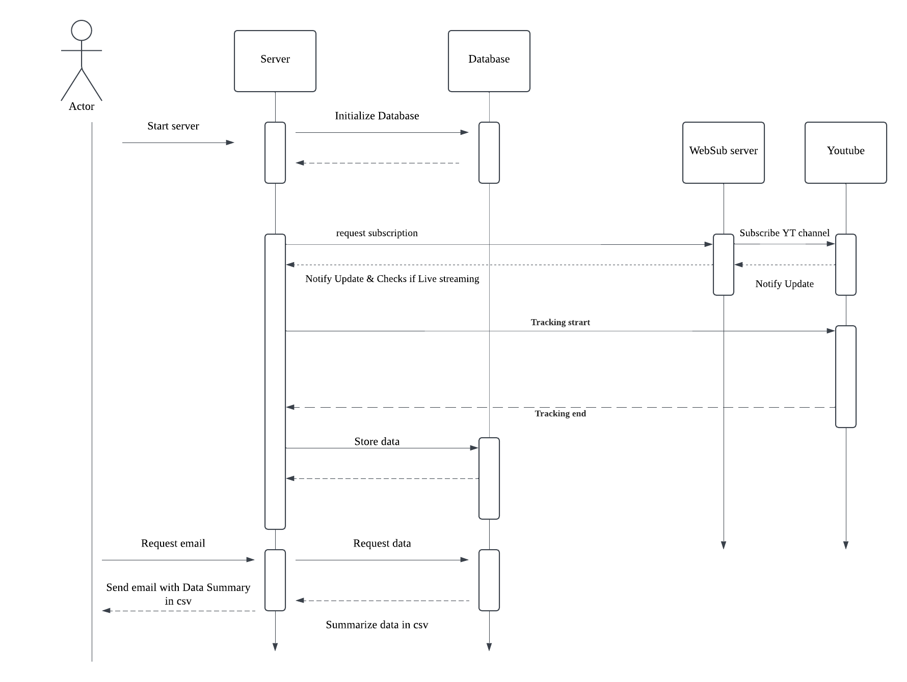

__TO RUN__

>npm start

but, you need .env for [backend](./backend/README.md)

# Youtube Livestreaming Tracking App
Users can register their favorite YouTube channels, then this system automatically detects live-streaming sessions by the registered channels as well as tracks the donations and comments by individual contributors.
The app can be used to collect live-streaming comment data, donations data by individuals, and channel total sales from each live-streaming session. 

## This is a backend logical flow

