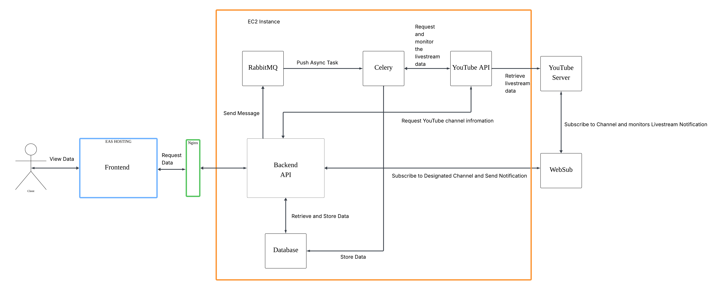
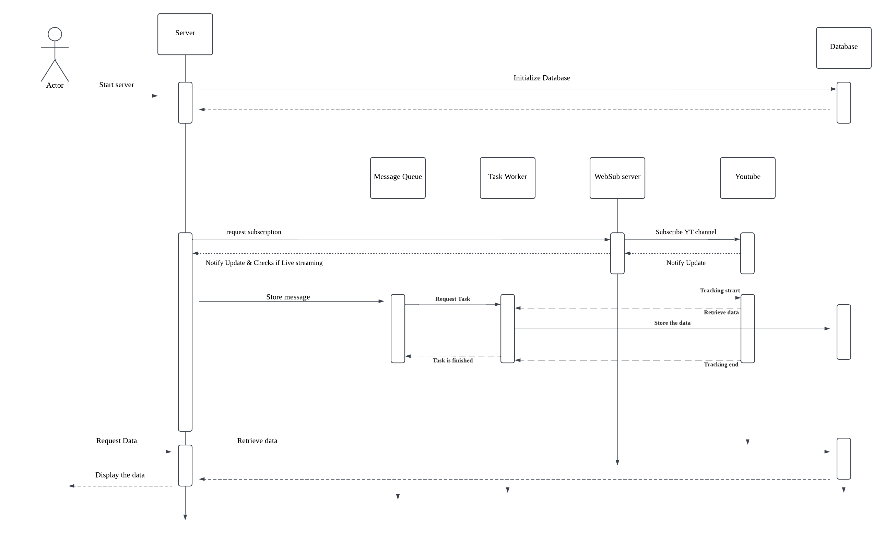
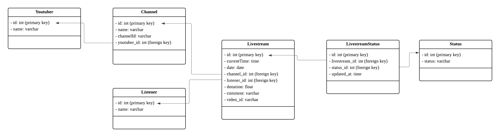

# System Architecture

## Overview

This document outlines the high-level and detailed system architecture of the YouTube Livestream Tracking Service.

## Business & Technical Requirements

- Monitor and track YouTube livestream comments and donations in real time
- *Support 100+ concurrent streams with sub-200ms API response time
- Maintain high availability and fault tolerance
- Provide analytics dashboard and developer-friendly API

## Architecture Diagrams

- System Overview  
  

- Sequence Diagram  
  

- Database Schema\
  

## Components

| Component         | Technology         | Description |
|------------------|--------------------|-------------|
| Server-side API        | Flask              | REST API, request validation, routing |
| Async Processing  | Celery + RabbitMQ  | Background processing for comments & donations |
| Database          | PostgreSQL         | Normalized data storage |
| Frontend          | React Native       | Mobile interface |
| Infra             | Docker, AWS EC2    | Containerized deployment |

[<- Back to README](../README.md)

